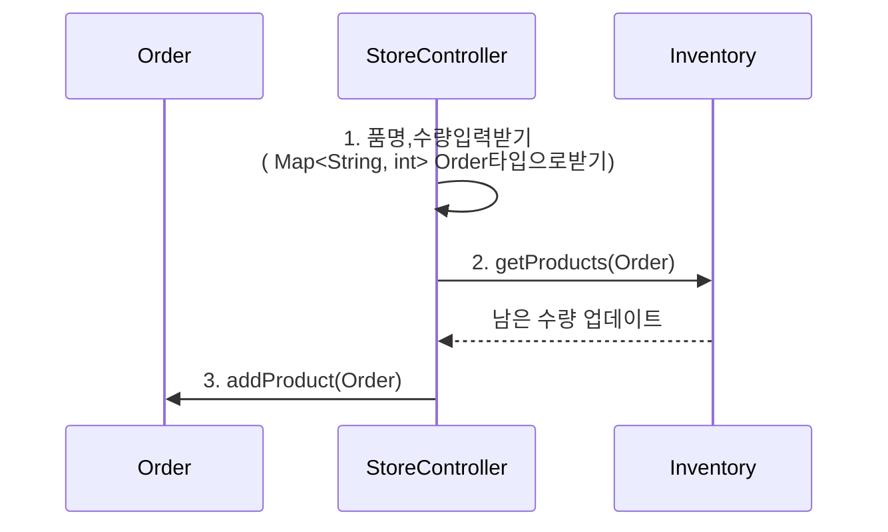

    

# 프리코스 4주차 미션 - 편의점

---

##  💪 미션 개요
 제공된 파일(상품과 행사정보)을 불러와서 재고를 셋팅하고
`재고관리`(행사기간에는 행사상품먼저 출고), `할인혜택`을 적용하여 `최종결제 금액을 안내`하는 시스템이다.

# 📝기능 목록
- [x] 파일안에 정보를 읽어오는 기능.
    - resources에 있는 `products.md`,`promotions.md`을 읽어온다.
- [x]  특정형식으로 입력된 문자열 파싱하는 기능
    - 특정형식으로 구매할 상품과 수량을 입력을 처리한다.(`ex.[콜라-10],[사이다-3]` )

- [x] 구매할 상품과 수량을 입력 받는다.(`ex.[콜라-10],[사이다-3]` )
  - [ ] `예외처리` : 입력 형식이 잘못된 경우(`[ERROR] 올바르지 않은 형식으로 입력했습니다. 다시 입력해 주세요.`)
  - [ ] `예외처리` : 존재하지 않는 상품을 입력한 경우(`[ERROR] 존재하지 않는 상품입니다. 다시 입력해 주세요.`)
  - [x] `예외처리` : 재고가 없을시 결제 불가능 메세지 출력(`[ERROR] 재고 수량을 초과하여 구매할 수 없습니다. 다시 입력해 주세요.`)
  - [ ] `기타예외 메시지` : `[ERROR] 잘못된 입력입니다. 다시 입력해 주세요.` 
  - [ ] `예외처리` : 메뉴 개수가 1 이상이 아닌 경우(`기타예외 메세지`)
  - [ ] `예외처리` : 중복 메뉴를 입력한 경우(`기타예외 메세지`)
  - [ ] `예외처리` : 빈 값인 경우(`기타예외 메세지`)

- [x] 재고차감 기능
  - [x] 특정 날짜에 진행중인 프로모션을 찾는 기능
  - [x] 프로모션상품, 기본상품을 구분하는 기능
  - [x] 이름으로 상품을 검색하는 기능
  - [x] 검색한 상품이 오늘 프로모션을 갖고있는지 확인하는 기능
  - [x] 상품에 갯수를 차감하는 기능(프로모션 진행여부에 따라 프로모션 상품 먼저 차감 )

- [x] 프로모션 안내 후 개수 추가 기능
  - [x] 프로모션 적용이 가능한 상품에 대해 고객이 해당 수량보다 적게 가져온 경우, 그 수량만큼  추가 여부를 입력받고 적용한. 
    ( Y: 증정 받을 수 있는 상품을 추가한다. N: 증정 받을 수 있는 상품을 추가하지 않는다. )
  - `안내메세지`: (`현재 {상품명}은(는) 1개를 무료로 더 받을 수 있습니다. 추가하시겠습니까? (Y/N)`)
  - `예외처리`: 기타 잘못된 입력의 경우(`[ERROR] 잘못된 입력입니다. 다시 입력해 주세요.`)
  
- [ ] 프로모션 혜택 기능
  - [ ] 프로모션 혜택은 `프로모션 재고` 내에서만 적용할 수 있다. -Order객체에서 할일
  - [ ] 프로모션 재고가 부족하여 일부 수량을 프로모션 혜택 없이 결제해야 하는 경우, 일부 수량에 대해 정가로 결제할지 여부에 대한 안내 메시지를 출력한다.-Order객체에서 할일 
  - `안내메세지` : `현재 {상품명} {수량}개는 프로모션 할인이 적용되지 않습니다. 그래도 구매하시겠습니까? (Y/N)` 
  (Y: 일부 수량에 대해 정가로 결제한다. N: 정가로 결제해야하는 수량만큼 제외한 후 결제를 진행한다.)

- [ ] 멤버십 할인 적용 여부를 입력 받는다.(Y/N) 
- [ ] 프로모션 미적용 금액의 30%를 할인받는다. 
  - 멤버십 할인의 최대 한도는 8,000원이다.
- [ ] `예외처리`: 기타 잘못된 입력의 경우
  - `예외 메시지`: `[ERROR] 잘못된 입력입니다. 다시 입력해 주세요.`

- [ ] 주문을 출력한다.
  - [ ] `구매 상품 내역`를 출력한다(`상품명 수량 금액`)
  - [ ] `증정 상품 내역`를 출력한다(`상품 수량`)
  - [ ] `금액 정보`을 출력한다(`총구매액 수량 금액`)
  - [ ] `행사할인` 금액을 출력한다
  - [ ] `멤버십할인` 금액을 출력한다
  - [ ] `내실돈`을 출력한다.
  - [X] `출력형식` 금액은 `#,###원` 형식으로 출력한다. (ex. `13,000원`)

- [] 추가 구매 여부를 입력 받는다. 
   ( Y: 재고가 업데이트된 상품 목록을 확인 후 추가로 구매를 진행한다. 
   N: 구매를 종료한다. )
- `예외처리`: 기타 잘못된 입력의 경우(`[ERROR] 잘못된 입력입니다. 다시 입력해 주세요.`)

- [출력 형식]구매 상품 내역, 증정 상품 내역, 금액 정보를 출력한다. 
   `===========W 편의점=============` 
   `상품명		수량	금액` 
   `콜라		3 	3,000` 
   `에너지바 		5 	10,000` 
   `===========증	정=============` 
  ` 콜라		1` 
   `==============================` 
  ` 총구매액		8	13,000` 
 `  행사할인			-1,000` 
   `멤버십할인			-3,000` 
 `  내실돈			 9,000` 
  

## 🙋‍♂️스스로 판단해본 기능 요구 사항
- [ ] 프로모션할인이 적용되지 않는 상품을 구매한 경우 안내메세지에서 N을 입력하면 프로모션적용이 아닌 상품은 구매목록에서 삭제한다
- [ ] 프로모션 기간이 아닐때 에는 기본상품을 먼저 차감한다.
 ---

## 시퀀스다이어그램

